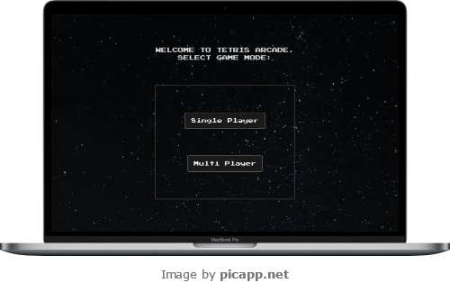
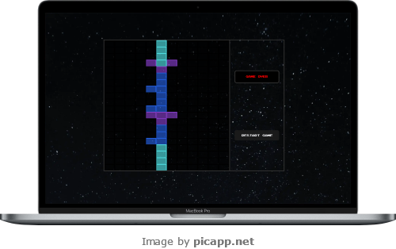
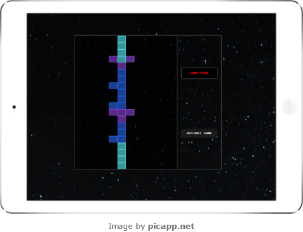
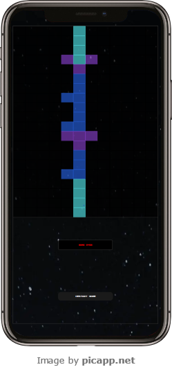

# Tetris Multiplayer Game

Tetris Multiplayer is a fullstack web application that allows users to play the classic game of Tetris either solo or against friends in real-time multiplayer mode

# Tech Stack

**Frontend** - Next JS <br />
**Backend** - Express + TS and Websockets using `ws` library for real-time communication in multiplayer mode

# Getting Started

- Clone the repository `https://github.com/NatsuDrag9/tetris-multiplayer.git`
- Open a terminal and navigate to the frontend dir `cd frontend`
- Create a ```.env``` file in ```frontend``` with the following environment variables:
  - ```NODE_ENV=development```
  - ```NEXT_PUBLIC_WEB_SOCKET_URL="ws://localhost:3000"```
  - ```NEXT_PUBLIC_BASE_URL="http://localhost:3000"```
- Open another terminal and navigate to the backend dir `cd backend`
- Start the server by executing `yarn run dev` in both terminals

<!-- _Currently, Tetris Multiplayer is only playable locally on your PC. However, it will soon be deployed on `Vercel` for easy access. Stay tuned for updates on our deployment progress!_ -->

# Documentation

Potential employers / recruiters, please visit [here](https://github.com/NatsuDrag9/tetris-multiplayer/wiki/Recruiters) <br>

Developers, please visit [here](https://github.com/NatsuDrag9/tetris-multiplayer/wiki/Developers) <br>

Players / gamers, please visit [here](https://github.com/NatsuDrag9/tetris-multiplayer/wiki/Players) <br>

For those who have spare time, please visit [here](https://github.com/NatsuDrag9/tetris-multiplayer/wiki)

# Credits and References

This application is my extention to **Thomas Weibenfalk's** [How to build Tetris in React](https://www.youtube.com/watch?v=ZGOaCxX8HIU) tutorial. Link to the [repo](https://github.com/weibenfalk/react-tetris-starter-files). While I drew inspiration from Thomas Weibenfalk's Tetris tutorial, **I expanded upon it by introducing real-time multiplayer capabilities**. By integrating Websockets and developing a backend server with Express and TypeScript, I added a new layer of gameplay, allowing users to compete against friends in real-time. This addition enhances the original single-player experience, offering users a dynamic and interactive multiplayer mode to enjoy together.

- Game background (from Unsplash, Clemen Vrankar).
- Fonts ([fontspace](https://www.fontspace.com/category/arcade)):
  - press start 2p by codeman38
  - emulogic by Freaky Fonts
- Application icon from [svgrepo](https://www.svgrepo.com/svg/283953/tetris)
- `#programming-help` channel of [Freecodecamp's Discord server](https://discord.com/invite/freecodecamp-org-official-fi-fo-692816967895220344).

# Screenshots

## Home screen



## Gameplay


<br >


<br >


